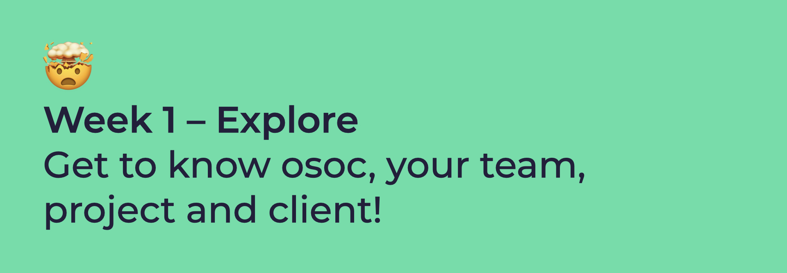

# Week 1: Explore

The goal of this week is to gather as much information you can; about your team members, project, the way you will work together, and what osoc is about. Let's roll!

{% embed url="https://calendar.google.com/calendar/embed?src=mietclaes.com_h1rs31a79809r742e5lpdpegbg%40group.calendar.google.com&ctz=Europe%2FBrussels&dates=20210705%2F20210709&mode=week" %}


[week-1-day-1-welcome-to-the-madness.md](week-1-day-1-welcome-to-the-madness.md)



[week-1-day-2-meet-the-client-and-start-hacking.md](week-1-day-2-meet-the-client-and-start-hacking.md)



[week-1-day-3-hackathon-end.md](week-1-day-3-hackathon-end.md)



[week-1-day-4-pitch-streams-and-learnings.md](week-1-day-4-pitch-streams-and-learnings.md)


