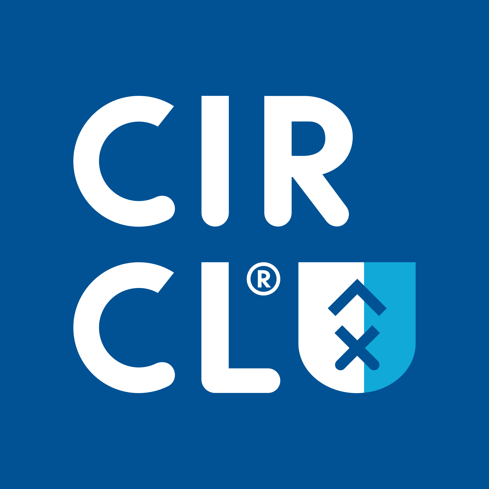
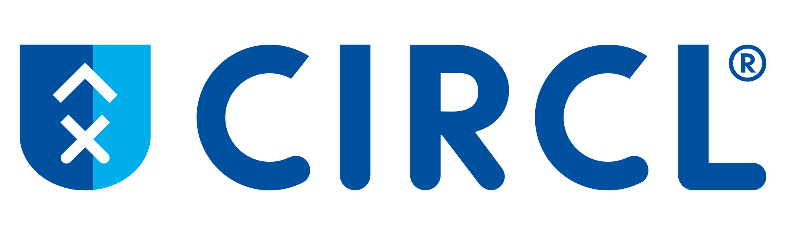

# CIRCL Vanhout

## Short description

Inspire people what their future home could look like based on 3D visualisations and open data.

## Project

**Project template:** [https://cloud.openknowledge.be/s/apwL5wMKjeMqzdf](https://cloud.openknowledge.be/s/apwL5wMKjeMqzdf)

**About the partner:** [http://circl.be](http://circl.be) (new venture of Vanhout)

_Your partner will give you a nice introduction as well on the first partner meeting!_

### Resources

#### Libraries we will use

* The JS library: [https://threejs-journey.com](https://threejs-journey.com) (ask for the login)
* The model we could use (integrated with Three) [https://ifcjs.github.io/info](https://ifcjs.github.io/info/)

#### 3D objects

* To be delivered

#### Context

* [https://circl.be/nieuw/tool/model.php](https://circl.be/nieuw/tool/model.php)
* [https://circl.be/nieuw/tool/model.php?project=1](https://circl.be/nieuw/tool/model.php?project=1) for simplified 2D visualisation
* [https://circl.be/nieuw/tool/model.php?project=1\&json](https://circl.be/nieuw/tool/model.php?project=1\&json) for the JSON export which contains an array of one or multiple building variants. Each variant contains info that can be used for 3D visualisation:
  * id: string
  * name: string
  * parcel: polygon = list of points (X,Y) for the plot where the building is located
  * volumes: array of polygons with the building volume per level (0 = ground floor, 1 = 1st level...)
  * &#x20;elements: array of building elements, each of which with
    * type: string
    * width, depth, height: size of the element as a "box' = all in mm
    * posX, posY, posZ: position in absolute (X,Y,Z) coordinates of the element
    * theta: rotation of the element in (X,Y) plane in radians
    * points: each object is a prism, the points describe the absolute coordinates (X,Y,Z) of the planar polygon describing the prism (height = derived from the "height" value), each element is in 3D "extruded" along the Z-axis
    * properties: key-value pairs describing some extra properties (= type specific)
      * for the "standard blocks" like staircase, toilet, bathroom, "svg" is one of the properties
    * stroke & fill: css-value for the colouring of the simplified 2D visualisation
* There's also some extra features in this model (for testing purposes):&#x20;
  * [https://circl.be/nieuw/tool/model.php?project=1\&labels](https://circl.be/nieuw/tool/model.php?project=1\&labels) which shows the element types
  * [https://circl.be/nieuw/tool/model.php?project=1\&nosliders](https://circl.be/nieuw/tool/model.php?project=1\&nosliders) which shows all variants for a building next/under eachother instead of sliders
  * [https://circl.be/nieuw/tool/model.php?project=1,2,3](https://circl.be/nieuw/tool/model.php?project=1,2,3) which shows multiple projects
* [https://circl.be/nieuw/tool/project.php?project=1](https://circl.be/nieuw/tool/project.php?project=1) is similar, but generates PDF drawings based on the same input
* [https://apps.autodesk.com/RVT/en/Detail/Index?id=7087667796484471162\&appLang=en\&os=Win64](https://apps.autodesk.com/RVT/en/Detail/Index?id=7087667796484471162\&appLang=en\&os=Win64) (Revit naar obj converting)

### GitHub

* Repository: [https://github.com/osoc22/project-vanhout](https://github.com/osoc22/project-vanhout)

### **Discord Channel**

\#circl-vanhout

## File storage

_For collaboration & storing files._&#x20;

**Figma workfile:** [https://www.figma.com/file/OogwCTfIKW8uOt54u9CdSU/Vanhout%2FCIRCL?node-id=0%3A1](https://www.figma.com/file/OogwCTfIKW8uOt54u9CdSU/Vanhout%2FCIRCL?node-id=0%3A1)



## Team

### Coaches

#### Lead

Robin Julien (CT Steward) - project coach

#### Support

Jodi De Loof - technical coach

### Students

Lin de Huybrecht

Brent Van Camp

Emmeline Martens

Ilya Plyusnin

Jorik Devreese\

### Specific councillors

Peter Bertels (CIRCL/Vanhout)

## Logo's

