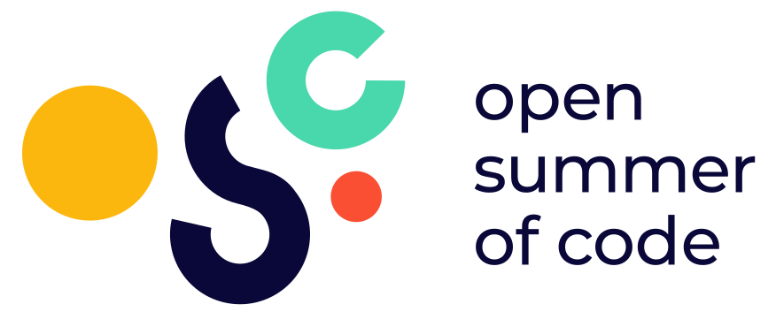

# Communications & Branding

## Short Description

Make osoc and its partners ✨ _shin_e ✨ ! \
__Show potential future students, partners and coaches why they should participate in open summer of code.\
\
What the comms team is responsible for? 💪\
You'll be doing internal communications, write project Highlights, take photos of all the teams and students, make buzz towards the outside world during #osoc22 (social media, blog, videos, photos), do the promo for the demo day. \
In addition to this, you are encouraged to rethink and set up a new branding strategy for open summer of code 2023 and think of new ways to promote osoc to participants (students, coaches, partners, sponsors) next year.

## Project

Project template: [https://cloud.openknowledge.be/s/mT42qn9ykfKqezp](https://cloud.openknowledge.be/s/mT42qn9ykfKqezp)

_Your partner will give you a nice introduction as well on the first partner meeting!_

### Resources

*   _About the partner_\
    Open summer of code is a 4-week summer programme during which innovative open source projects are made by incredibly motivated students, coaches & organisations.&#x20;

    Osoc is powered by Open Knowledge Belgium, a non-profit supporting a world where knowledge creates power for the many, not the few.\
    The osoc [website](http://osoc.be)\
    The [Open Knowledge Belgium](http://openknowledge.be) webside\
    The [Open Knowledge international](https://okfn.org) website
* _Style components_\
  [FIGMA](https://www.figma.com/file/94fo7Pl97dmlQxPv4UJkDV/Design-Project-socials-\(Copy\)) #osoc21
* [Partner package ](https://cloud.openknowledge.be/s/BGmKK3GGZSkdGQM)for 2022
* [Partner deck](https://cloud.openknowledge.be/s/4t7kHQ9kzkqAMwz) for 2022

### GitHub

Example:

* Team: [https://github.com/orgs/osoc21/teams/the-floof-fighters](https://github.com/orgs/osoc21/teams/the-floof-fighters)
* Repository: [https://github.com/osoc21/RoadBase](https://github.com/osoc21/RoadBase)

### **Discord Channel**

\#osoc-comms

## File storage

_For collaboration & storing files. Add the root folder to your drive:_ [_https://drive.google.com/drive/folders/1D08v4bgtmXnukuTmZKsI7lpz3uWxLNW0?usp=sharing_](https://drive.google.com/drive/folders/1D08v4bgtmXnukuTmZKsI7lpz3uWxLNW0?usp=sharing)__



## Team

### Coaches

#### Lead

Niels Dewelde

#### Support

Lotte Goyens

### Students

Britt Vanzegbroeck (student coach)\
Guilherme Chuna

### Specific councillors

Miet Claes

## Logo's

